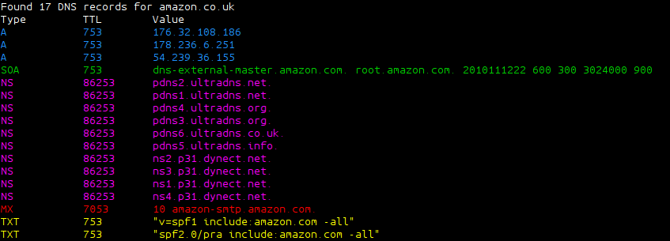

# Dig Improved

This script takes the output from `dig` and colourises and sorts it to make it easier to read

## Example

Return all DNS records for exampledomain.co.uk:

    ./diga.sh exampledomain.co.uk

Return just A records for exampledomain.co.uk:

    ./diga.sh exampledomain.co.uk -r A

## Parameters

The following optional parameters are available
The parameter defaults are in the []:

    -r|--record	The record type to look for [ANY]
